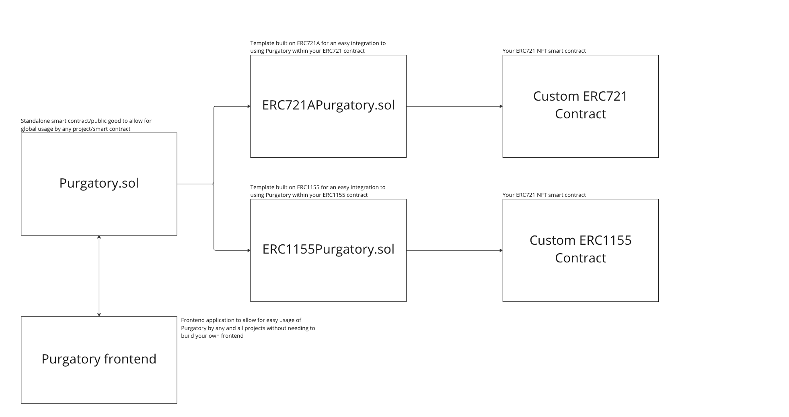

# Purgatory
Purgatory is an anti-theft system which can be leveraged by NFT creators to provide security
benefits to their holders aimed at protecting against the most common threats in the ecosystem.
The system introduces a "Purgatory state" where token approvals and transfers are pending until
the Purgatory time period is complete, or the user approves the request from an authorized
two factor wallet (i.e. on-chain 2FA).

Purgatory consists of a standalone smart contract and ERC721/ERC1155 extensions developers can leverage
in their own NFT smart contracts. Purgatory will be a globally deployed contract that NFT creators can easily
hook into by using the global contract for improved interoperability and simplicity. With that said, we've also
provided a separate "Self Deploy" version which allows NFT creators to deploy the `PurgatorySelfDeploy.sol` contract a single time 
which can then be used by all subsequent NFT projects by the creator, and then implement the `ERC721APurgatory`
or `ERC1155Purgatory` extensions within their NFT smart contract. `PurgatorySelfDeploy` comes with a few admin functions
for the NFT creator to modify parameters and enroll collections, while the global Purgatory contract is completely
permissionless and trustless with no administrative functions.

By default when opted in to Purgatory, users will have additional security controls to help protect against
the most common threats in the ecosystem. There are also additional opt-in features such as short-lived approvals,
lockdown mode, and more to provide additional options for enhanced security controls.

## Documentation
For detailed documentation on using Purgatory, please refer to the [User Guide](docs/userguide.md).

To better understand how Purgatory works at a technical level, and if you wish to contribute or leverage
the system, please refer to the [Dev Guide](docs/devguide.md).

## What does Purgatory consist of?
1. Purgatory.sol - The core standalone smart contract that your NFT project can hook into in order to leverage Purgatory. This can either be deployed as a standalone contract to support all collections under a project/creator, or alternatively use the already deployed global Purgatory contract in order to enable a better overall user experience as deploying a separate contract would result in users needing to set two-factor wallet approvers, global transfer recipients, etc. on each new Purgatory contract.
2. ERC721APurgatory.sol - A security module built on ERC721A to be inherited by your ERC721 project to allow for easy integration with Purgatory.
3. ERC1155Purgatory.sol - A security module built on ERC1155 to be inherited by your ERCC1155 project to allow for easy integration with Purgatory.

See below for a basic diagram on the smart contract aspect of Purgatory:


## Usage

As an NFT creator, you will first need to use the deployed global Purgatory contract (deployment TBD) or 
deploy the [PurgatorySelfDeploy.sol](contracts/self-deploy/PurgatorySelfDeploy.sol) contract. Once done, 
you can use this same contract to enroll all NFT collections you wish to integrate with Purgatory.

There are sample implementations for different token standards available within the 
[tests contracts directory](contracts/test/); however, please see below for a sample implementation 
for an ERC721A NFT smart contract.

```solidity
// SPDX-License-Identifier: MIT
pragma solidity ^0.8.17;

import "../tokens/ERC721APurgatory.sol";

contract TestERC721A is ERC721APurgatory {
    constructor (address purgatoryContract_) ERC721APurgatory("PurgatoryTest", "PT", purgatoryContract_) {}

    function mint(uint256 amount, address owner) public {
        _safeMint(owner, amount);
    }
}
```

Note that the ERC Purgatory templates implement [OpenZeppelin's Ownable](https://github.com/OpenZeppelin/openzeppelin-contracts/blob/master/contracts/access/Ownable.sol)
by default as the Purgatory collection enrollment process requires the contract owner (determined via the `owner()` function) to toggle enrollment. Otherwise, Ownable is
not a requirement and can be removed in favor of a custom `owner()` function implementation.

Please refer to the [IPurgatory.sol](contracts/interfaces/IPurgatory.sol) file for the interface to 
interact with, with accompanying comments/documentation:

```solidity
/**
***************************
* Approval request setters
***************************
*/

function setTwoFactorWalletApprover(address approver, bool approved, bool canEnableLockdown, bool isAuthorizedRecipient) external;
function setApprovedRecipient(address collection, address recipient, bool approved) external;
function setApprovedGlobalRecipient(address recipient, bool approved) external;

/**
********************************
* Opt/Config Setters
********************************
*/

function setOptStatus(bool optedIn, uint64 shortLivedApprovalLength) external;
function setShortLivedApprovalLength(uint64 shortLivedApprovalLength) external;
function toggleLockDownMode() external;
function enableLockDownModeFromTwoFactorWalletApprover(address holder) external;
function refreshApproval(address collection, address operator) external;

/**
********************************
* 2FA wallet Approval setters
********************************
*/

function setApprovalForOperatorApproval(address holder, address operator, address collection, bool approved) external;
function setApprovalForTransferRecipient(address holder, address recipient, address collection, bool approved) external;
function setApprovalForGlobalTransferRecipient(address holder, address recipient, bool approved) external;
function setApprovalForDeactivatingLockDown(address holder) external;

/**
***********************************
* ERC721/1155 integrated functions
***********************************
*/

function validateTransfer(address from, address operator, address recipient) external view;
function validateApproval(address from, address operator, bool approved) external;
function isApproved(address from, address operator) external view returns (bool);

/**
***********************************
* External view functions
***********************************
*/

function isOptedOut(address holder) external view returns (bool);
function isLockedDown(address holder) external view returns (bool);
function isShortLivedApprovalEnabled(address holder) external view returns (bool);
function operatorApprovalStatus(address collection, address holder, address operator) external view returns (RequestStatus memory);
function transferRecipientApprovalStatus(address collection, address holder, address recipient) external view returns (RequestStatus memory);
function twoFactorWalletApprovalStatus(address holder, address approver) external view returns (RequestStatus memory);
function lockDownStatus(address holder) external view returns (RequestStatus memory);
function optInStatus(address holder) external view returns (RequestStatus memory);
function shortLivedApprovalStatus(address holder) external view returns (RequestStatus memory);
function getRemainingOperatorApprovalTime(address collection, address holder, address operator) external view returns (uint256);
function isApproved(address from, address operator, address collection) external view returns (bool);
```

## Contributing
We hope everyone and anyone will use Purgatory, and we also hope to the community will contribute to 
make it the best it can be. If you would like to contribute, please follow the below steps:

1. Fork the Purgatory project
2. Create a branch for your feature
3. Commit & push your changes and open a pull request in this repo

Alternatively, if you discover any bugs or have any feature requests that you do not plan to implement 
yourself, you are free to open an "Issue" within this repository.

### Unit Tests
Please be sure to add [unit tests](test/unit/purgatory.ts) for your feature and run the tests locally:

```yarn test```

## Reaching Out
If you have any questions, need help implementing, or something else, please feel free to reach out:

- maximonee (Smart Contracts & Technical Design) | [@maximonee_](https://twitter.com/maximonee_)
- Aure (Frontend) | [@aurealarcon](https://twitter.com/aurealarcon)
- Samuel Cardillo (Everything & Anything Else) | [@CardilloSamuel](https://twitter.com/CardilloSamuel)
