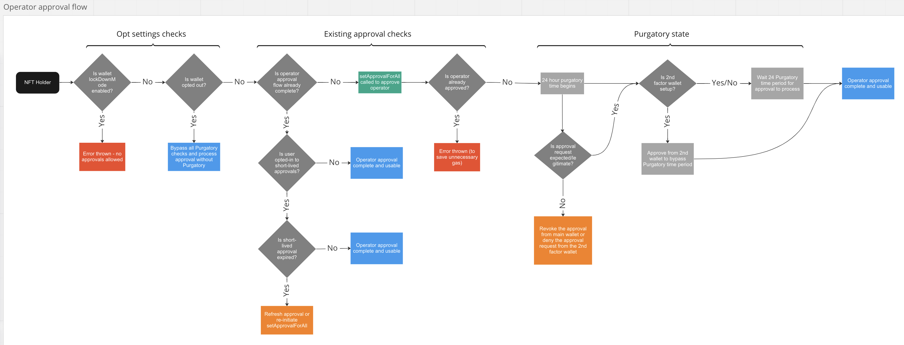
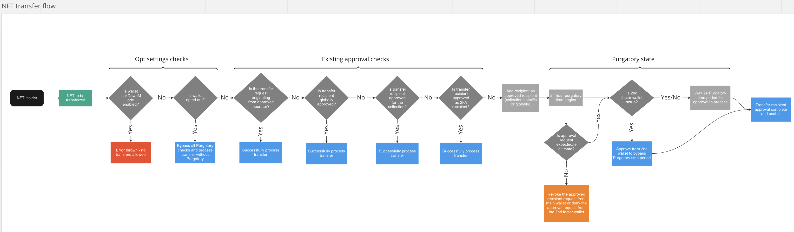
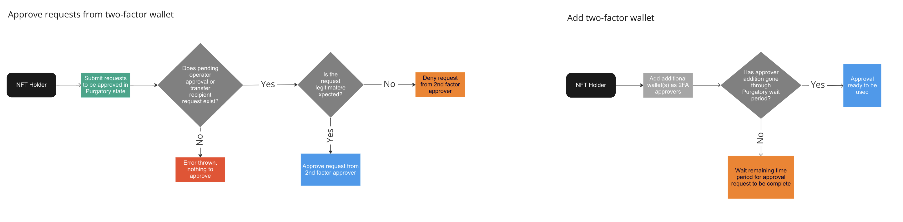

# Purgatory User Guide

## What is Purgatory?
Purgatory is an anti-theft system which can be leveraged by NFT creators to provide security
benefits to their holders aimed at protecting against the most common threats in the ecosystem.
The system introduces a "Purgatory state" where token approvals and transfers are pending until
the Purgatory time period is complete, or the user approves the request from an authorized
two-factor wallet (i.e. on-chain 2FA). Once you approve an operator or transfer recipient for the 
first time, it will then be considered approved and you won't need to reapprove it unless you revoke 
access at any time.

The general idea of Purgatory is that a request originates from a main wallet and must be 1) approved by an 
authorized two-factor wallet, or 2) wait the Purgatory time period for the request to be validated. This means 
that both of your wallets must be compromised if you are using Purgatory with best practices in order for an
attacker to have access to your assets. Please note that since all requests must originate from the main wallet, 
simply compromising a two-factor wallet will not have any negative impact on your main wallet's security.

By default when opted in to Purgatory, users will have default security controls enabled to help protect against
the most common threats in the ecosystem. Depending on your security tolerance, there are additional opt-in features to 
further lock down your assets.

## Glossary
* **Purgatory State**: The pending state a request goes into after initially requested. The request will become automatically approved after the Purgatory time is completed or once approved by an authorized two-factor wallet
* **Purgatory Time**: The time period where a request is pending in the Purgatory State (default: 24 hours)
* **Main Wallet/Holder Wallet**: The wallet holding the NFTs where approval or transfer requests originate from
* **Two-factor (2FA) Wallet**: Additional wallets authorized to approve requests originating from the main wallet to bypass the Purgatory time period and complete the Purgatory state
* **Operator**: An address which is authorized to transfer NFTs on behalf of the NFT holder which approved the access (likely through the `setApprovalForAll` function) 
* **Request**: A request is the transaction classification when the approval enters the Purgatory state but is not fully validated, and can be approved, denied, or wait out the Purgatory state

## How does it work?
There are three main use cases that Purgatory is injected into to provide additional security controls.
See each section below for how that particular use case is impacted with the use of Purgatory:

### Operator Approvals
When a token approval is done, the approval enters the purgatory state where token transfers utilitizing that approval are blocked. The requestor can choose one of
four options:

1. Wait the required purgatory time period. Once done, the approval is validated and transfers using that approval can begin.
2. Realize that the approval was malicious and not intended, and revoke the approval while still in the purgatory period.
3. Use another wallet as a "second factor" to approve the approval request at any time within the purgatory period to bypass the purgatory wait period.
4. Use another wallet as a "second factor" to deny the approval request in the case of the original requestor wallet is not readily available.

See below for a diagram of the operator approval flow:

### Token Transfers
When a token holder wishes to transfer a token manually, they must first set an approved transfer recipient (or authorize 2FA wallets as approved recipients). 
Recipients can approved for individual collections or can alternatively be setup as a globally approved recipient meaning tokens of all collections can be transferred
to the recipient. This request goes through the same purgatory time period as above and transfers to this recipient are blocked until that is the case. Similar to 
above, the requestor can choose to:

1. Wait the required purgatory time period. Once done, the transfer request is validated and transfers to that recipient can begin.
2. Realize that the transfer was malicious and not intended, and revoke the transfer request while still in the purgatory period.
3. Use another wallet as a "second factor" to approve the transfer request at any time within the purgatory period bypass the purgatory wait period.
4. Use another wallet as a "second factor" to deny the transfer request in the case of the original requestor wallet is not readily available.

It's important to note that token transfers by approved operators (see above Operator Approval flow) do **not** get
blocked by the token transfer flow. This is because 1) the approval through Purgatory is already done and 2) blocking 
operators from transferring would break core functionality for NFTs such as marketplace buys/sales. This means that 
attack vectors utilizing existing approvals (i.e. OpenSea signature phishing) are still valid attack vectors. To protect 
against those, we recommend opting into additional configuration options, such as short-lived approvals.

See below for a diagram of the token transfer flow:

### Two-factor Authentication
As mentioned in previous areas above, two-factor wallets can be setup to approve your main wallet's requests to bypass the Purgatory time period and complete the Purgatory state. You can setup multiple two-factor wallets for your main wallet.

See below for a diagram of the two-factor auth flow:

## Common Scams and How Purgatory Helps
While there are many different techniques scammers use to steal your NFTs, they generally all roll up to a few different mechanisms:

### Malicious Operator Approvals
When you sell an NFT, you may notice that the first time you do so for a given collection the transaction costs gas 
and you are calling the `setApprovalForAll` function to give that operator (i.e. OpenSea) access to transfer NFTs on 
your behalf. This is required in order for marketplaces to properly be able to sell and transfer NFTs on your behalf. 
You have likely heard of `setApprovalForAll` scams in the NFT space which use the same function, but instead trick you 
into setting another operator, in this case the scammer, as an approved operator to transfer your NFTs on your behalf.
This is typically done through some kind of social engineering attack such as a fake claim, giveaway, trading site, etc.

#### How does Purgatory help?
By ensuring all operator approval requests go through the Purgatory state, you have the adequate time to realize that the 
approval is not legitimate which you can revoke access to before it goes into effect. This allows you to still recover 
without any lost assets if you are able to realize the malicious approval prior to the Purgatory state completing.

### Malicious NFT Transfers
Using the same social engineering techniques from above, scammers will also bypass the operator approval step and ask you 
to directly transfer NFTs to their wallet when you visit their phishing site. If you do not carefully review what the 
transaction is asking for, you may accidentally transfer your valuable NFTs away.

#### How does Purgatory help?
By ensuring transfer recipients of your NFTs must be first authorized and go through the Purgatory state, you can be sure 
tokens cannot be transferred away without the proper authorization. This requires the scammer to trick you into signing 
multiple transactions to add their wallet as an approved recipient, wait the Purgatory time period, and finally trick you 
again to transferring the NFT to their wallet. With all these steps, it would be very difficult for the scammer to be 
able to use this vector.

### Marketplace Signature Phishing
Quickly becoming one of the most common scam vectors, marketplace signature phishing involves signing a gasless transaction to sell your NFTs to the scammer for 0 ETH. This is done by using your existing approvals (i.e. to OpenSea) 
and then trick you into signing the message (which would look like an OpenSea listing) to sell your NFTs for free. This 
would also use the same attack vectors as the above scams, which are some kind of social engineering attack.

#### How does Purgatory help?
This is one area that Purgatory cannot 100% solve due to the nature of how NFTs work and how marketplaces need 
uninterrupted access to be able to transfer your NFTs in order to sell. With that said, we have added additional opt-in 
features which can greatly help reduce this risk - the most important being short-lived approvals. Short-lived approvals
allow you to set a length of time where the approval remains valid. After that time period expires, the approval must be
refreshed or reapproved. This means that you are significantly less likely to have stale approvals active that scammers 
can use to take advantage of. Additionally, lockdown mode can be activated to be sure that no approvals can be made and 
no tokens can be transferred out of your wallet.

## Opt-in System
In order to benefit from Purgatory, you will need to opt in to the overall system. When you opt-in, the benefits apply
immediately. However, when you opt-out, the Purgatory system will still be active for the entirety of the Purgatory time.
This means if the Purgatory time is 24 hours, the Purgatory system will remain active for 24 hours from the time you 
opt-out.

There are additional security features you can choose to opt-in that will further increase your security. Please refer to 
the [Optional Features](#optional-features) section for details on these.

## Optional Features
When you opt-in to use the Purgatory system, there are additional features you can enable to enhance your security. These are:

### Lockdown Mode
Users can choose to activate lockdown mode which is not enabled by default. Lock down mode allows a user to activate 
extra security controls to not allow their NFTs to be approved or transferred while active. Lockdown mode is disabled 
by default as it is only for those who wish for a maximum level of security (i.e. vaults) and never expect to transfer 
NFTS out or approve operators. Activating lockdown mode is an instant action, and deactivating it must go through the 
Purgatory state. Another use case for lockdown mode could be if you believe your wallet is compromised, you can activate 
lockdown mode to stop all ability to transfer NFTs out of the wallet and disable all approvals.

In order to prevent potential griefing issues with marketplaces by listing an NFT for a value much lower than the floor 
while having it be untradeable, the marketplace operator approval will not show as approved to ensure listings cannot be 
made while locked down. This same feature also applies for all aspects of Purgatory pending requests where relevant.

#### Lockdown From Two-factor Wallet
When authorizing a two-factor wallet, you can give it permission to enable lockdown mode for your main wallet. This can 
be useful if you wish to quickly enable lockdown mode on a believed compromised main wallet but you don't have access 
to the main wallet at that time. Note that this only allows for the 2FA wallet to enable lockdown mode, 
but disabling it must be initiated from the main wallet.

### Short-lived Approvals
When opting in to Purgatory, users can set a time (in seconds) that token approvals last for. As an example, if a user 
wants their approvals to last for 48 hours, then after 48 hours (plus the Purgatory time i.e. 24 hours, which means the 
total approval length is 72 hours), the approval  will become invalid. The user can then choose to reapprove the 
operator, or simply refresh the approval for another 48 hours (or whatever the user has defined as their approval 
length). The goal of this feature is to have less stale approvals, greatly reducing the risk and likelihood of attack 
vectors that leverage existing approvals such as OpenSea/marketplace signature phishing attacks.

This feature is highly encouraged given the prevalence of marketplace signature phishing attacks. This is the most 
effective way to mitigate this risk while using the Purgatory system outside of enabling lockdown mode.

Please note that as a safety measure to prevent abuse via compromised wallet, if short-lived approvals are changed,
approval length will default to the Purgatory time (i.e. 24 hour length) while the request is in the Purgatory state.
This means that if you have an approval over that time period that is now expired, you can choose to either 1) set
a new approval/refresh that approval or 2) wait for the change to complete the Purgatory state and use your newly
set short-lived approval length as desired.

### Two-factor Authorized Recipients
Wallets that you add as authorized two-factor wallets can also be set as approved recipients for token transfers. 
This can be useful if you have trusted wallets you wish to transfer NFTs between without needing to individually add 
them as approved recipients and go through the Purgatory state for.

## Best Practices
As you have hopefully seen, Purgatory can be used to greatly protect you against the most common threats seen in the 
NFT ecosystem. With that said, we have the following recommendations for configuration to be sure you are best taking 
advantage of the capabilities of the system.

1. Setup two-factor wallets. While you can use Purgatory without two-factor wallets, we recommend utilizing this feature 
to be sure that you have the ability to deny requests in the case your main wallet is hacked and you are unable to access 
it at a given time.
2. Your two-factor wallets should be setup with different seed phrases from your main wallet. This is important to ensure
that if either your main wallet or two-factor wallet seed phrase is compromised, that the attacker cannot gain access
to the other wallet and bypass Purgatory security controls.
3. Setup approved recipients. Having approved recipients setup before you need them is a helpful way to ensure you are 
able to safely transfer NFTs out of your wallet in the case your wallet is hacked. For example, if your seed phrase is 
compromised, you are still able to transfer NFTs out to approved recipients before the scammer can steal your assets. 
This is because with an approved recipient, the scammer is not able to add to their own recipient or revoke yours 
without waiting for the Purgatory state to be complete. This gives you a 24 hour window to safely transfer assets out 
to your approved recipients.
4. Use short-lived approvals. Some of the most common scam vectors take advantage of existing approvals. By ensuring 
you do not have any stale approvals active that you no longer need, you can completely stop this vector from being an 
area of concern.
5. If you have a pure vault wallet, use lockdown mode. If you know you will not need to transfer assets out of your 
wallet, activating lockdown mode can be a nice safety feature to allow you to have confidence your assets cannot be 
transferred out even if you accidentally end up on a phishing site and attempt to sign a bad transaction.
6. Have as little approvals active as possible. As mentioned, existing approvals can be a problem for different scam 
vectors. Having as little open approvals as possible will greatly reduce the risk of your assets being stolen.
